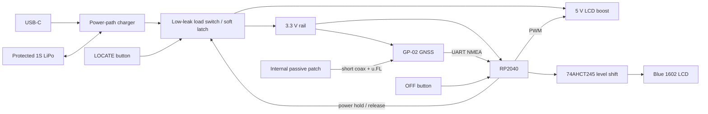

# Maidenhead Pocket Locator — Build Plan

Status: software and enclosure sources implemented; hardware engineering draft complete; manufacturing and physical validation blocked on the recorded DRC, sourcing, quote, prototype, and measurement gates
Target batch: 5–20 devices  
Hard landed-cost target: **US$30 or less for every unit, including the first five**  
Licensing goal: reciprocal open source

## 1. Product definition

Build a compact, battery-powered amateur-radio companion that obtains its current position from GNSS and displays the corresponding six-character Maidenhead locator on a blue-backlit 16×2 character LCD.

The device is intended for desks, portable radio outings, and use in occupied vehicles. It should feel like a useful radio tool and a fun object to give to other operators. It is not a navigation device, emergency beacon, location logger, or formally rated waterproof product.

### Default display

```text
GRID: OJ11XH
▰ 14:35 19/08
```

The battery glyph is illustrative. The firmware will use one of the LCD's custom-character slots for a four-level battery icon.

### Primary interaction

1. Hold `LOCATE` for one second.
2. The device powers up and immediately shows `ACQUIRING GPS` rather than a cached grid.
3. On a valid fix, it calculates and displays the six-character locator and flashes the backlight briefly.
4. By default, the backlight dims 60 seconds after the original `LOCATE` button-down edge.
5. By default, the device shuts down 120 seconds after that same button-down edge.
6. Holding `OFF` for one second shuts it down early.
7. Holding both buttons for five seconds restores factory settings after an on-screen countdown.

Once the one-second hold is accepted, all timers are backdated to the initial `LOCATE` button-down edge, including time spent validating the hold and acquiring GNSS. If the default two-minute acquisition timeout expires without a fix, show `NO GPS` for three seconds and shut down; this terminal message is the only default exception to the 120-second power-off deadline.

### Configuration modes

The Python configurator selects one of two GNSS behaviors:

- `single_fix`: acquire one valid position for the session, display it, and stop active GNSS tracking.
- `tracking`: continue processing fixes and update the locator every five seconds until shutdown.

In tracking mode, a new locator must appear in two consecutive valid fixes before replacing the displayed locator. This prevents grid flicker near a subsquare boundary.

### Non-goals for V1

- No location history or logging; coordinates are discarded at shutdown.
- No stale-location fallback.
- No external GNSS antenna connector.
- No automatic geographic time-zone detection.
- No Wi-Fi, Bluetooth, mobile app, buzzer, lanyard, or belt clip.
- No immersion rating or untested IP claim.
- No on-device settings menus.

## 2. Acceptance criteria

V1 is complete only when all of the following pass:

| Area | Acceptance criterion |
|---|---|
| Locator | Correct uppercase six-character Maidenhead output from WGS-84 latitude/longitude, including boundary and antimeridian tests |
| Cold fix | At least 9 of 10 open-sky cold-start trials produce a valid grid within the configured default two-minute timeout |
| Stability | A new grid appears only after two consecutive valid fixes agree |
| Battery outing | Survives an eight-hour test with four full two-minute checks per hour and retains enough charge for one additional check |
| Stored unit | Electronics shutdown current is at most 10 µA at 25 °C; after realistic one-year cell self-discharge, the design budget still allows at least one location check |
| Controls | Each button requires a deliberate one-second hold; bag pressure and short taps do not latch the device on |
| USB | Charging, configuration, and normal location operation work while connected |
| Firmware recovery | An interrupted or invalid update can be recovered through the internal RP2040 ROM BOOTSEL control without a debugger |
| Configuration | Settings persist across shutdown, reject corruption, and can be saved/restored as profiles |
| Weather goal | Passes the drizzle and sand procedures in section 8 with no internal ingress or control failure |
| Thermal | Operates at 40 °C ambient and inhibits charging when the battery sensor is too warm |
| Mechanical | Front profile remains approximately 85 × 41 mm; total depth does not exceed 35 mm |
| Cost | Quoted landed cost is no more than US$30 per finished unit when ordering the first five |

The locator definition and test vectors should follow the ADIF WGS-84 encoding: positions 1–2 use `A–R`, 3–4 use `0–9`, and 5–6 use `A–X`. See the [ADIF Maidenhead definition](https://adif.org.uk/315/ADIF_315.htm#Maidenhead_Locators).

## 3. Hardware plan

### 3.1 Architecture



### 3.2 Candidate parts and rationale

These are design candidates, not permission to order. Freeze exact manufacturer part numbers only after schematic review, stock confirmation, physical layout, and the cost gate.

| Function | V1 candidate | Reason / constraint |
|---|---|---|
| MCU | RP2040 + 2 MB QSPI flash | Low-cost native USB, adequate UART/PWM/ADC, mature C/C++ SDK, and UF2 recovery in immutable ROM. The [RP2040 datasheet](https://datasheets.raspberrypi.com/rp2040/rp2040-datasheet.pdf) documents the USB controller and ROM bootloader. |
| GNSS receiver | Ai-Thinker GP-02 | Cost-down choice; multi-constellation receiver with UART NMEA and passive/active antenna support. Use the [manufacturer specification](https://docs.ai-thinker.com/_media/gp-02_specification.pdf) as the schematic authority. |
| GNSS antenna | Internal passive L1 ceramic patch with short coax and u.FL/I-PEX plug | Allows the patch to mount beneath the top wall and face the sky without enlarging the LCD-like front profile. Final antenna must provide documented dimensions, cable loss, ground requirements, and operating temperature. |
| GNSS fallback | Quectel L86-M33 | Use only if the GP-02 plus remote patch fails reception tests. Its integrated patch is lower RF-integration risk but materially more expensive. |
| LCD | HD44780/ST7066-compatible blue-backlit 16×2 module, nominal 80 × 36 mm | Matches the requested Arduino-kit appearance. Freeze a 5 V part with measured backlight current and published outline drawing. A representative module is up to 13.5 mm thick; see [Winstar WH1602B](https://www.winstar.com.tw/products/lcd-display/character-lcd-display-module/lcd-display-16x2.html). |
| LCD level translation | 74AHCT245, write-only 4-bit LCD bus | RP2040 remains at 3.3 V; AHCT inputs reliably recognize its logic-high level while driving a 5 V LCD. Tie LCD `R/W` low and use fixed command delays. |
| LCD supply | TPS61023 set to 5 V | Efficient boost converter with true disconnect and about 0.1 µA shutdown current. See [TI TPS61023](https://www.ti.com/product/TPS61023). |
| Backlight control | Logic-level MOSFET driven by MCU PWM | Provides normal/dim brightness sliders, success flash, and full backlight cutoff. Verify the selected LCD includes or receives a safe LED current-limiting resistor. |
| Charger / power path | BQ24074 | Supports simultaneous system use and charging, input limiting, thermal regulation, and battery NTC monitoring. See [TI BQ24074](https://www.ti.com/product/BQ24074). Do not replace it with a charger lacking load sharing merely to save cost. |
| Battery | Replaceable protected 1S LiPo, preliminary 1,000 mAh, keyed JST-PH-class connector | Capacity is intentionally provisional. Freeze it after measuring the selected LCD and a complete two-minute session. Use a reputable protected cell; prevent reverse insertion mechanically and electrically. |
| Battery indication | Switched high-value divider into MCU ADC | Four-level icon only. Enable the divider only while measuring; calibrate thresholds against the assembled unit under a known light load. |
| Charge indication | Charger status output to a red LED behind a sealed light pipe | LED is on while charging and off when complete or unplugged. The LCD remains dark merely because USB is attached. |
| USB-C | USB 2.0 device connector with CC resistors, ESD protection, and tethered sealing plug | Must work with USB-A-to-C and C-to-C data cables. USB provides charging, CDC configuration, and firmware update. |
| Buttons | Two side-mounted tactile switches under matching recessed elastomer actuators | Both require a one-second hold. Actuators should feel like a radio PTT rather than exposed PCB buttons. |

### 3.3 Power behavior

Use a hardware soft-latch rather than relying on MCU deep sleep:

- A `LOCATE` press temporarily enables the post-charger system load switch.
- The MCU asserts `POWER_HOLD` only after the press remains valid for one second.
- Releasing `POWER_HOLD` removes power from the MCU, GNSS, LCD boost, level shifter, and sensor divider.
- USB VBUS independently enables the MCU so the configurator is always reachable. USB insertion must not light the LCD or start GNSS by itself.
- While USB is present, `OFF` returns the firmware to USB-idle mode because external power intentionally keeps the configurator alive.
- The charger and cell protection remain connected during shutdown. Their combined battery drain, plus load-switch leakage, must meet the 10 µA electronics target.
- Do not maintain GNSS backup power for a full year; accept a cold start after long storage in exchange for lower drain.
- Add a power-on-reset supervisor if testing shows unreliable latch startup or flash corruption near battery cutoff.

Preliminary charging configuration:

- USB input: 5 V only; no USB Power Delivery negotiation.
- Input limit: 500 mA unless thermal testing supports more.
- Charge current: select after the exact cell is chosen; never exceed its datasheet rating.
- Battery NTC: use the cell's third wire when available, otherwise mount a board thermistor firmly against the cell pouch.
- Charging should stop outside the cell supplier's permitted temperature window; the 40 °C ambient requirement is not permission to charge an overheated cell.

### 3.4 PCB

- Design in KiCad using a two-layer board first to control cost.
- Let JLCPCB assemble all SMD parts, including RP2040, GP-02, charger, converters, USB-C, ESD, and level shifting.
- Keep hand work to the LCD/header, battery plug-in, antenna plug-in, actuator installation, and enclosure assembly.
- Place labelled test points for `VBUS`, `BAT`, charger output, `3V3`, `5V_LCD`, `GND`, `POWER_HOLD`, UART TX/RX, SWDIO, SWCLK, RUN, and BOOTSEL.
- Route the GP-02 RF output to u.FL as a short 50 Ω grounded coplanar trace using JLCPCB's actual stack-up. Add ground stitching vias and obey the receiver and connector keep-outs.
- Keep the GNSS/RF area away from the 5 V boost inductor, LCD edge, USB data pair, and RP2040 crystal.
- Place USB-C, LED light pipe, button switches, LCD header, and battery connector from the CAD assembly—not by schematic convenience.
- Add polarity, pin-1, connector, and button labels to silkscreen.
- Export manufacturing files, schematic PDF, interactive BOM, pick-and-place, and JLC assembly drawings from versioned source.

### 3.5 Enclosure

Target envelope: approximately **85 × 41 × no more than 35 mm**. The front outline remains close to the LCD PCB; depth absorbs the battery, PCBA, sealing, and antenna orientation.

Construction:

- Two-piece screw-fastened FDM enclosure in PETG or ASA; do not use PLA for the field version.
- Continuous perimeter gasket in a designed compression groove. Use hard stops so screws cannot crush or extrude the gasket.
- Recessed clear polycarbonate LCD window with its own gasket or continuous closed-cell adhesive seal; do not expose the LCD glass directly.
- Matching recessed elastomer button boots or a single molded membrane over the two tactile switches.
- Tethered USB-C port plug and a gasketed/light-pipe charging indicator.
- Internal ceramic patch adhered beneath the top wall, ceramic face toward the sky, with no battery, display PCB, fastener, metallic coating, or copper immediately above it.
- Replaceable battery retained without puncture risk, foam compression on the pouch, or strain on its leads.
- Captive or retained threaded inserts where practical; repeated battery access must not destroy FDM screw holes.
- No lanyard or clip features.

Weather claim: “designed for drizzle, dust, and incidental sand exposure; not for immersion.” A future machined enclosure should preserve the PCB, control, antenna, window, and gasket interfaces.

### 3.6 Cost gate

The following is a target allocation, not a quote. It includes allocated setup and shipping but excludes the builder's labor and borrowed tools, matching the agreed parts-cost definition.

| Cost group | Target per unit |
|---|---:|
| LCD | $2.00–3.50 |
| GP-02 + internal patch/coax | $3.50–5.00 |
| RP2040, flash, clock, USB | $1.75–2.75 |
| Charger, load switch, 3.3 V/5 V power, level shifting, protection, passives | $3.50–5.00 |
| Protected LiPo + connector | $3.00–5.00 |
| PCB and PCBA allocation | $3.00–5.00 |
| Enclosure, window, gasket, actuators, screws, light pipe | $2.50–4.00 |
| Allocated shipping, setup, extended-part, and fixture charges | $2.00–4.00 |
| **Target total** | **$21.25–34.25** |

Because the high estimate exceeds the requirement, cost control is a formal milestone:

1. Prepare the complete five-unit JLCPCB cart and every non-JLC purchase before ordering anything.
2. Include taxes, shipping, setup, assembly, stencil/fixture, spare-part minimums, and enclosure consumables.
3. Divide the total by five finished devices; do not hide unused minimum-quantity parts outside the calculation.
4. If the total exceeds $150, reduce cost and requote. Do not order on the assumption that later units will amortize it.
5. Cost-down order: consolidate JLC basic parts, source LCD/cell/window hardware locally, simplify non-safety mechanical hardware, then compare compatible documented GNSS/antenna parts.
6. Do **not** cost down by removing cell protection, NTC monitoring, power-path/load sharing, USB ESD, the gasket/window, or firmware recovery.

## 4. Firmware plan

### 4.1 Stack and modules

Use the Raspberry Pi Pico C/C++ SDK with CMake. Keep hardware drivers thin and put all conversion, layout, configuration, and state behavior in host-testable C++ modules.

Suggested modules:

```text
firmware/
  app/             state machine and event loop
  board/           pins, clocks, ADC, power hold, boot entry
  gnss/            UART transport, NMEA parsing, fix validity
  maidenhead/      pure WGS-84 coordinate-to-locator conversion
  display/         1602 driver, glyphs, PWM, screen composition
  layout/          validated 16-character field renderer
  time/            GNSS UTC and configured named-zone transitions
  config/          schema, defaults, migration, CRC, atomic storage
  usb/             CDC protocol, diagnostics, bootloader command
  tests/            native and device tests
```

### 4.2 State machine

| State | Entry / behavior | Exit |
|---|---|---|
| `OFF` | Hardware rails absent | `LOCATE` begins enabling power, or USB supplies configuration power |
| `PRESS_CHECK` | Count a continuous one-second `LOCATE` hold; if accepted, use the initial button-down edge as all timer epoch | Short release → power drops; valid hold → `ACQUIRING` |
| `USB_IDLE` | CDC/configuration active; LCD and GNSS off | `LOCATE` → `ACQUIRING`; USB removal → power drops unless held |
| `ACQUIRING` | Show `ACQUIRING GPS`; parse only current live fix data | Valid fix → `DISPLAY_FIX`; timeout → `NO_GPS`; `OFF` → shutdown |
| `DISPLAY_FIX` | Show `GRID: XX00XX`, battery, time/date layout; flash backlight | Single-fix mode stops GNSS; tracking mode continues; dim deadline → `DIMMED` |
| `DIMMED` | Use configured dim PWM; continue selected GNSS mode | Shutdown deadline or `OFF` → shutdown; valid tracking fix may update grid |
| `NO_GPS` | Show failure for three seconds | Release power hold |
| `FACTORY_RESET` | Both buttons held five seconds with countdown | Atomically restore defaults and restart |

Debounce inputs in software and ensure watchdog recovery cannot accidentally hold power forever. After accepting the hold, start both default deadlines from its initial button-down edge, not one second later and not from first fix.

### 4.3 Fix validity and grid calculation

- Accept only a receiver-declared valid 2D/3D fix with valid latitude, longitude, UTC date, and UTC time.
- Reject out-of-range, NaN, truncated, checksum-failed, and stale NMEA sentences.
- Keep coordinates in RAM only.
- Convert from WGS-84 latitude/longitude to exactly six characters: field letters, square digits, subsquare letters.
- Normalize output to uppercase (`OJ11XH`).
- Define behavior explicitly at `+90`, `-90`, and `±180` degrees to avoid array overflow; clamp only as specified by the test oracle.
- In tracking mode, stage a changed grid and commit it only after the next valid fix returns the same new grid. A fix in the currently displayed grid cancels the candidate.
- Parse at the receiver's normal output rate but render/update no more often than every five seconds in tracking mode.

### 4.4 Display and configuration schema

Factory defaults:

| Setting | Default |
|---|---|
| Top row | `GRID: {grid6}` |
| Bottom row | battery icon, one space, `HH:MM`, one space, `DD/MM` |
| Named time zone | `Asia/Singapore` |
| Clock | 24 hour, seconds off |
| GNSS mode | `single_fix` |
| Tracking render interval | 5 seconds |
| Acquisition timeout | 120 seconds |
| Dim deadline | 60 seconds from `LOCATE` press |
| Shutdown deadline | 120 seconds from `LOCATE` press |
| Normal brightness | 100% logical level, capped by hardware-safe PWM |
| Dim brightness | 20% logical level |

Supported bottom-row building blocks:

- Battery glyph: four levels plus charging state if useful while the LCD is intentionally on.
- Time: 12/24 hour and seconds independently selectable.
- Date presets: `DD/MM`, `MM/DD`, `DDMMM`, and `YYYY-MM-DD`.
- Arbitrary static text, including callsigns.
- Literal spaces and a small set of separators.

The GUI must prevent any rendered variant from exceeding 16 characters. Validate worst cases such as `12:59:59 PM`, not only the current preview value.

Store configuration in two versioned flash slots with sequence number and CRC. Write the inactive slot, verify it, then mark it current. On invalid or unsupported configuration, boot safe factory defaults and report the error over USB.

### 4.5 Named time zones

V1 does not infer a zone from coordinates. The GUI uses Python's IANA `zoneinfo` data to let the user choose a named zone and sends a compact table of future UTC offset transitions for that one zone.

- Generate at least 15 years of transitions from the configuration date.
- Store the zone name, generation date, expiry year, initial offset, abbreviations, and transitions.
- Zones without daylight-saving transitions, including the `Asia/Singapore` default, remain simple.
- After the table expires, continue with the last known offset but report `timezone_refresh_required` in USB diagnostics.
- Reconfiguring or applying a profile regenerates the transition table from the host's current time-zone database.
- Automatic geographic zone detection remains a future firmware feature and must not be implied by V1 UI copy.

### 4.6 Diagnostics

Expose read-only USB diagnostics without retaining location history:

- Firmware and hardware revision.
- Configuration schema version and CRC health.
- Battery ADC reading and derived level.
- Charger/input state and onboard temperature.
- GNSS state, current satellite/fix-quality fields, and latest coordinates only while the session is active.
- Shutdown-current measurement cannot be self-reported because the MCU is unpowered; document the external test.

## 5. Python configurator plan

### 5.1 Stack

- Python 3.11 or newer.
- Tkinter for the cross-platform window.
- `pyserial` for USB CDC discovery and communication.
- Standard-library `zoneinfo` for named zones; document how Windows users obtain current IANA data if their Python installation lacks it.
- Custom in-window drag-and-drop behavior so arranging fields does not depend on platform-native file drag APIs.

Support Windows, macOS, and Linux equally. Users are expected to install Python; packaged executables are not a V1 requirement.

### 5.2 GUI screens

1. **Device** — connection state, firmware/hardware version, battery, settings health, and diagnostics.
2. **Display builder** — draggable battery/time/date/text blocks, properties panel, and exact 16-character live preview.
3. **Behavior** — single-fix/tracking selection, acquisition timeout, dim/shutdown timers, and normal/dim brightness.
4. **Time** — named-zone chooser, 12/24-hour selector, seconds toggle, and date format.
5. **Profiles** — create, save, load, import, export, compare, and apply versioned JSON profiles.
6. **Firmware** — select a UF2, validate compatibility, back up the current profile, update, reconnect, and verify the reported version.
7. **Factory reset** — explicit confirmation and post-reset verification.

### 5.3 USB protocol

Use newline-delimited, versioned JSON over USB CDC for readability and community implementation.

Every request contains `protocol_version`, `request_id`, and `command`. Every response echoes the request ID and returns either structured data or a stable error code. Required commands:

- `hello`
- `get_info`
- `get_config`
- `validate_config`
- `set_config`
- `get_diagnostics`
- `factory_reset`
- `reboot_to_bootloader`

Set operations are transactional: validate in RAM, persist atomically, read back, and only then report success. Cap message size and reject unknown or malformed input without destabilizing the device.

### 5.4 Profiles

- Human-readable JSON with profile schema version, display layout, behavior, time settings, and optional notes.
- Do not include coordinates or transient GNSS diagnostics.
- Migrate older profile versions explicitly; never silently discard fields.
- Show a diff before applying a profile to a connected device.
- Regenerate named-zone transitions at apply time rather than treating old transition tables as permanent profile data.

### 5.5 Firmware updates and recovery

Normal flow:

1. User selects any RP2040 UF2 file; community/custom images are allowed and signatures are not required.
2. GUI checks UF2 structure and RP2040 family compatibility. It warns, rather than pretending custom code is trusted.
3. GUI exports the current configuration profile.
4. GUI commands the device into ROM BOOTSEL, detects the mounted `RPI-RP2` volume, copies the UF2, waits for reconnect, and verifies the firmware-reported result when supported.
5. Official firmware migrates or preserves the reserved configuration region when compatible. A custom UF2 may overwrite or ignore it, so the profile backup is mandatory.

Recovery flow:

- Remove the gasketed rear cover, hold a clearly labelled internal `BOOTSEL` tact switch, and attach USB-C. This enters ROM recovery independent of application firmware without adding a leak-prone exterior hole or risky multiplexing onto `OFF`.
- The GUI detects the ROM volume and performs the same copy operation.
- Expose labelled BOOTSEL/RUN test pads beside the switch as a final manufacturing fallback.

Raspberry Pi documents BOOTSEL as read-only ROM that cannot be overwritten by application software; see the [Pico recovery documentation](https://www.raspberrypi.com/documentation/microcontrollers/pico-series.html#resetting-flash-memory).

## 6. Repository and licensing

```text
/
  PLAN.md
  CONTEXT.md
  LICENSES/
  docs/
    adr/
    assembly/
    testing/
  hardware/
    kicad/
    bom/
    manufacturing/
  enclosure/
    source/
    exports/
  firmware/
  configurator/
  tools/
```

Licenses:

- Firmware and Python configurator: `GPL-3.0-or-later`.
- PCB and mechanical source: `CERN-OHL-S-2.0`.
- Documentation: `CC-BY-SA-4.0`.
- Include SPDX identifiers in source files and a clear contribution/licensing section in the future README.

These reciprocal licenses implement the requirement that distributed derivatives remain open. Review third-party fonts, libraries, footprints, and CAD models before inclusion; prefer compatible permissive or reciprocal dependencies.

## 7. Implementation phases

### Phase 0 — deterministic software core

- Establish repository, licenses, CI, formatting, and host test harness.
- Implement and exhaustively test Maidenhead conversion before touching hardware.
- Implement NMEA parsing against captured and synthetic streams.
- Implement state machine, grid stabilization, layout rendering, configuration schema, and profile schema as host tests.
- Build a GUI prototype with a simulated device transport.

Exit: conversion/state/layout/profile tests pass on Windows, macOS, and Linux CI.

### Phase 1 — electrical design and quote

- Select exact LCD, passive patch, cell, actuators, connectors, gasket, and charger configuration.
- Measure or obtain trustworthy worst-case LCD backlight current before fixing cell capacity and charge current.
- Draft schematic, power budget, off-current budget, RF layout, PCB outline, and connector placement.
- Review against every manufacturer reference circuit.
- Create preliminary enclosure stack-up and verify the 85 × 41 × 35 mm envelope.
- Produce complete five-unit landed quote.

Exit: schematic review complete, dimensional stack fits, predicted shutdown current ≤10 µA, and five-unit total ≤$150. Otherwise redesign and requote.

### Phase 2 — PCB and enclosure release

- Finish placement with a shared PCB/enclosure datum model.
- Route, run ERC/DRC, inspect Gerbers, verify footprints against physical drawings, and generate assembly outputs.
- Print an unpopulated enclosure fit-check or dimensional mock-up before PCBA release.
- Order five assembled boards only after the cost gate passes.
- Print one enclosure first; keep the remaining four until fit corrections settle.

Exit: order reviewed from generated artifacts by checklist, not only inside KiCad.

### Phase 3 — first-board bring-up

- Use a borrowed multimeter. Begin with battery disconnected and a current-limited/protected USB source.
- Inspect polarity, solder bridges, QFN alignment, connectors, and antenna lead before power.
- Check ground continuity and absence of shorts; then verify VBUS, charger output, 3.3 V, and 5 V rails.
- Load a minimal firmware in this order: power hold, USB, buttons, LCD, ADC, then GNSS.
- Confirm charger behavior and temperature cutoff before connecting the production cell.
- Confirm BOOTSEL recovery before installing the gasketed enclosure.

Exit: one complete unit passes all basic functional and safety checks without rework wires. If rework is necessary, decide whether the remaining boards are safe to populate/use or require a PCB revision.

### Phase 4 — validation

- Run the complete test matrix in section 8.
- Measure actual active current at full and dim backlight, single-fix mode, and tracking mode.
- Recalculate capacity and one-year standby budget with measured data.
- Record antenna orientation and ground-plane effects; invoke the L86 fallback only if placement/tuning cannot make GP-02 pass.
- Use test results to update enclosure clearances, gasket compression, firmware defaults, and assembly instructions.

Exit: all acceptance criteria pass and remaining risks are documented.

### Phase 5 — public V1 release

- Tag reproducible firmware and configurator releases.
- Publish KiCad, CAD source, exact BOM with substitutes, Gerbers, assembly files, firmware UF2, Python setup instructions, profiles, test evidence, and assembly guide.
- Include prominent LiPo, heat, charging, water-resistance, and non-emergency-device warnings.
- Build and give out the remaining units only from the validated revision.

## 8. Test matrix

### Software

- Known Maidenhead vectors from an independent reference implementation.
- Randomized property tests across valid WGS-84 coordinates.
- Exact field/square/subsquare boundaries, poles, equator, prime meridian, and antimeridian.
- NMEA checksums, missing fields, contradictory RMC/GGA validity, stale sentences, and UART truncation.
- Two-fix grid stabilization, including `A → B → A`, `A → B → B`, and invalid fixes between candidates.
- Button bounce, short press, exactly one-second press, simultaneous press, and stuck button.
- Timer ordering and invalid configuration such as shutdown earlier than dim.
- Every display field combination and worst-case 16-character width.
- DST forward/back transitions, zones without DST, half/quarter-hour offsets, transition-table expiry, and `Asia/Singapore` reset default.
- Power loss during each phase of configuration write.
- Malformed/oversized USB requests and reconnect during operations.
- Firmware update interruption before copy, during copy, and during reconnect.

### GNSS and RF

- Ten true cold starts outdoors with backup power discharged.
- Warm repeated checks during an eight-hour outing.
- Face-up, handheld, desk-angle, and vehicle-dashboard orientations.
- Near-window indoor behavior is recorded but is not a pass/fail promise.
- Compare GP-02 patch placement alternatives before changing receiver.
- Verify the 5 V boost, USB, and LCD refresh do not measurably degrade satellite acquisition.

### Power and battery

- Validate charger current, termination, power-path operation, and charge LED.
- Operate GNSS/LCD while charging and while the battery is absent if the charger design permits it.
- Confirm NTC hot/cold inhibition by safely simulating sensor resistance.
- Measure shutdown current at full, half, and low cell voltage.
- Run 32 two-minute sessions spread over eight hours, with factory brightness/timers, followed by one reserve check.
- Verify low-battery behavior does not repeatedly reboot or corrupt flash.
- Treat the one-year criterion as an electronics drain budget plus the selected cell maker's self-discharge/aging data; do not claim it solely from an accelerated bench test.

### Mechanical and environmental

- Verify LCD, PCB, antenna, cell, wires, connector bend radius, window, and gasket fit without forced compression.
- Cycle each button at least 1,000 times on a sacrificial/prototype enclosure and check boot sealing afterward.
- Open and reseal the battery compartment at least ten times.
- Drizzle test: controlled spray from multiple directions for ten minutes, USB cap installed, with absorbent indicator paper inside; no visible ingress.
- Sand test: expose seams/buttons/cap to dry beach-like sand, brush clean, then verify actuation and opening without grains reaching electronics.
- Soft-ground drop tests from normal hand height in multiple orientations.
- Operate at 40 °C ambient; inspect enclosure deformation, LCD readability, GNSS behavior, cell temperature, and charger inhibition.
- Do not test immersion because V1 does not claim it.

### Cross-platform configurator

- Clean Python setup on current Windows, macOS, and Linux.
- Device discovery with multiple serial ports present.
- Apply/read-back profiles, Unicode rejection or transliteration for unsupported LCD characters, and missing time-zone data handling.
- Normal and recovery firmware updates on all three systems.
- Clear errors for charge-only USB cables and permission-denied serial ports.

## 9. Principal risks and mitigations

| Risk | Mitigation / decision gate |
|---|---|
| First-five landed cost exceeds $30 each | Complete carts before ordering; GP-02 is primary; iterate sourcing/part consolidation until total is ≤$150 |
| Internal passive patch has weak reception | Top-wall placement, short controlled RF path, orientation tests; L86-M33 fallback only after placement experiments |
| 35 mm depth is insufficient | Physical stack model and printed fit-check before PCBA order; front width/height stay fixed while internal mounts are revised |
| Blue LCD dominates power | Measure exact module; hardware current limit and PWM; resize cell before freeze |
| One-year storage misses a check | True hardware cutoff, ≤10 µA measured electronics drain, protected reputable cell, no maintained GNSS backup |
| FDM enclosure leaks | Designed gasket compression, separate window seal, button membrane, USB plug, spray/sand test; no IP claim |
| Charging at high temperature damages cell | BQ24074 NTC monitoring, cell-adjacent thermistor, conservative current, explicit no-hot-car-charging warning |
| Firmware update appears to brick device | Hardware BOOTSEL gesture and immutable RP2040 ROM recovery; profile backup before update |
| Named-zone rules become stale | Host-generated 15-year transition table and diagnostic expiry flag |
| Custom firmware breaks configuration compatibility | Allow it by design, warn clearly, export profile first, and preserve ROM recovery |

## 10. Decision summary

The detailed rationale is recorded under `docs/adr/`.

- A deliberately simple two-button locator replaces an on-device menu.
- The LCD always shows the current six-character locator, never a stale one.
- USB-C is the single charging, configuration, and update connection.
- A Python/Tkinter GUI provides profiles and a drag-and-drop 16-character row builder.
- RP2040 and compiled C/C++ provide deterministic firmware and recoverable updates.
- GP-02 plus a remote internal passive patch is the V1 cost architecture; L86-M33 is the reception fallback.
- A hardware power latch and power-path charger support one-year storage intent and operation while charging.
- The enclosure preserves the LCD front outline by growing only to a maximum 35 mm depth.
- V1 is drizzle/sand resistant, not immersion-rated.
- All distributed derivatives must remain open through reciprocal licenses.
